# Frequency-Fourier-Diffusion-Model-for-Deepfake-detection

# 1. General Idea

## Synthesizing Spectral Fingerprints with Diffusion Models

This project explores a novel generative paradigm: training Diffusion Models directly on the **frequency spectrum** rather than the standard RGB spatial domain. By modeling the true spectral distribution of real images, the goal is to synthesize realistic spectra that, once inversely transformed, produce coherent RGB images.

Modern generative models can produce highly realistic images in the spatial domain, but these images often contain artifacts, in the frequency domain, which can act as **synthetic fingerprints** and can be exploited by forensic detectors to distinguish real images from generated ones.

The central idea of this project is therefore to move the diffusion process itself from RGB space to a frequency representation based on the **2D Discrete Cosine Transform (DCT)**.

Two comparable diffusion models are trained:

1. **Frequency-domain DDPM**  
   Images are transformed into DCT coefficients before diffusion. The model learns to denoise and generate directly in this spectral representation.

2. **RGB DDPM baseline**  
   A comparable diffusion model is trained directly on RGB images.

The two models are evaluated both in terms of conventional image-generation quality and in terms of their spectral and forensic properties.

---

# 2. Project Motivation

Deep generative models are commonly optimized for perceptual image quality. However, visual realism does not necessarily imply that the underlying image statistics match those of real photographs.

The main research question of this project is:

> **Can a diffusion model trained directly on frequency representations generate images whose spectra are closer to those of real images than a standard RGB diffusion model?**

A secondary question is whether this spectral improvement makes generated images more difficult to distinguish from real images using simple frequency-based forensic classifiers.

The project does **not** assume that frequency-domain generation must automatically improve visual quality. Instead, visual fidelity and spectral fidelity are evaluated independently.

---

# 3. Pipeline Overview

The main frequency-domain pipeline is:

```text
Real RGB Image
      │
      ▼
Face Detection / Cropping
      │
      ▼
Resize to 64 × 64 RGB
      │
      ▼
Global 2D-DCT
(per RGB channel)
      │
      ▼
Spectral Normalization
+ SNR Balancing
      │
      ▼
Frequency-Domain DDPM
      │
      ▼
Generated Normalized DCT
      │
      ▼
Inverse Normalization
      │
      ▼
Inverse 2D-DCT
      │
      ▼
Generated RGB Image
```

The RGB baseline follows the conventional pipeline:

```text
Real RGB Image
      │
      ▼
Face Detection / Cropping
      │
      ▼
Resize to 64 × 64 RGB
      │
      ▼
RGB DDPM
      │
      ▼
Generated RGB Image
```

Both models use the same general compact U-Net family and approximately comparable model capacity. 

---

# 4. Dataset

## Celeb-DF

The experiments use [**Celeb-DF**](https://github.com/yuezunli/celeb-deepfakeforensics), a face-forensics dataset containing both real and manipulated videos. 

The dataset is separated at the **video level rather than the frame level**.

The completed experiment used:

| Split | Videos | Frames |
|---|---:|---:|
| Training real | 370 | 17,760 |
| Validation real | 8 | 256 |
| Final evaluation real | 30 | 1,920 |
| Synthetic forensic reference | 62 | 992 |

Synthetic Celeb-DF videos are **not used to train the generative models**.

The DDPM models are trained only using real videos from:

```text
Celeb-real/
YouTube-real/
```

`Celeb-synthesis` is retained as an external synthetic reference for the forensic experiments.

This avoids teaching the generative models the spectral characteristics of an existing deepfake generator.


<p align="center">
  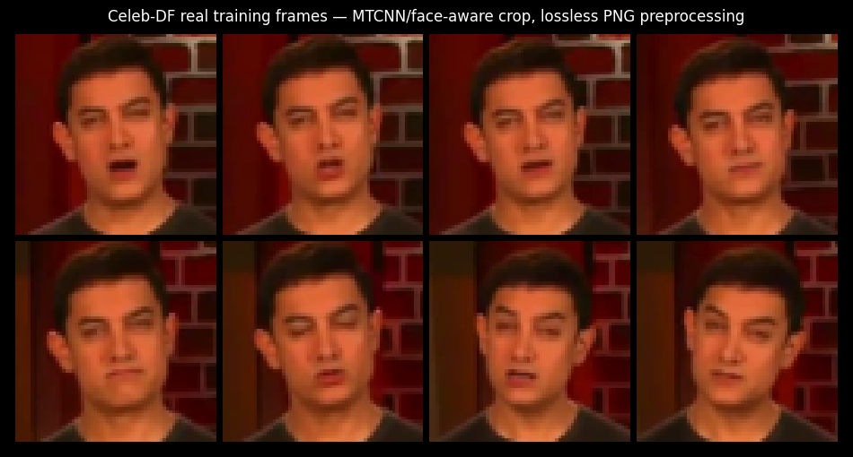
  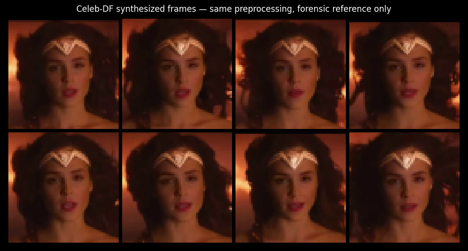
</p>
<p align="center"><em>Figure 1. Examples of the real training face crops (left) and synthetic forensic-reference crops (right) after the same preprocessing pipeline.</em></p>

# 5. Face Preprocessing

Frames are sampled from each video and processed before training.

The preprocessing pipeline is:

1. sample frames from the input video;
2. detect the main face;
3. enlarge the detected face region using a configurable margin;
4. crop the face;
5. resize the crop to **64 × 64**;
6. store the result as a lossless PNG image.

The preferred face detector is **MTCNN** through `facenet-pytorch`.

---

# 6. Frequency Representation

The frequency-domain model uses a global orthonormal **2D Discrete Cosine Transform**.

The transform is applied independently to the:

- red channel;
- green channel;
- blue channel.

Therefore, an RGB image of shape:

```text
3 × 64 × 64
```

is converted into a DCT representation with the same dimensionality:

```text
3 × 64 × 64
```

The transformation is invertible, allowing generated coefficients to be converted back into RGB images using the inverse DCT.

---

# 7. Spectral Normalization and SNR Balancing

Raw DCT coefficients have extremely different statistical scales: low-frequency coefficients generally contain much larger energy than high-frequency coefficients.

To reduce this imbalance, the project implements two stages:

### Partial whitening

Each frequency is scaled according to its estimated variance.

The current configuration uses:

```text
spectral_whitening_power = 0.60
```

Partial rather than complete whitening is used so that the natural frequency structure is not entirely removed.

### Diffusion-state variance balancing

An additional variance-dependent scaling is applied with:

```text
diffusion_balance_power = 0.75
```

This acts as a compromise between preserving natural spectral structure and providing a better-conditioned diffusion state.


### Before balancing

```text
Standard-deviation ratio ≈ 17.61×
```


### After q = 0.75

```text
Standard-deviation ratio ≈ 2.05×
```


# 8. Diffusion Model

Both models use a DDPM-style diffusion process.

The main configuration is:

| Parameter | Value |
|---|---:|
| Image resolution | 64 × 64 |
| Diffusion steps | 1000 |
| Noise schedule | Cosine |
| Prediction target | v-prediction |
| Min-SNR gamma | 5.0 |
| Self-conditioning | Enabled |
| Self-conditioning probability | 0.50 |
| Base channels | 64 |
| Dropout | 0.10 |
| EMA decay | 0.9995 |

The neural network learns how to generate a new sample starting from noise.

For the frequency model, **the diffusion state itself consists of normalized DCT coefficients**.

---

# 9. Network Architecture

Both models use the same general compact U-Net family.

This keeps the comparison focused mainly on the representation being modeled rather than simply giving one system significantly more model capacity.

## RGB model

Input:

```text
3 RGB channels
```

## Frequency model

The frequency model receives the normalized DCT representation together with explicit information describing the position of each coefficient in frequency space.

Three coordinate maps are provided:

```text
horizontal frequency
vertical frequency
radial frequency
```

These maps help the network distinguish low-frequency and high-frequency positions.

The frequency network also includes **depth-wise large-kernel mixing** in early encoder stages.

The current kernel size is:

```text
5 × 5
```

This provides a wider frequency context than a conventional small convolution.

This modification is useful because locality in DCT space does not have the same interpretation as locality in RGB space.

---

# 10. Auxiliary Losses

The frequency-domain model uses a small number of auxiliary regularizers.

These losses do **not** replace frequency-domain diffusion.

The forward and reverse diffusion processes remain entirely in DCT space.

The losses are introduced progressively during training rather than applying their full weights from the beginning.

The objective is to avoid a model that matches only the strongest low-frequency coefficients while failing to preserve spatial structure and fine details.

---

# 11. Training Strategy

Training includes several techniques intended to improve stability and reduce computational cost:

- exponential moving average weights;
- gradient clipping;
- learning-rate warm-up;
- checkpointing;
- early stopping;

The current main configuration includes:

```text
Frequency learning rate: 1.5e-4
RGB learning rate:       2.0e-4
Weight decay:            2.0e-4
Gradient clipping:       1.0
Warm-up epochs:          3
```

The frequency model supports warm-starting and fine-tuning from a previous experiment.


<p align="center">
  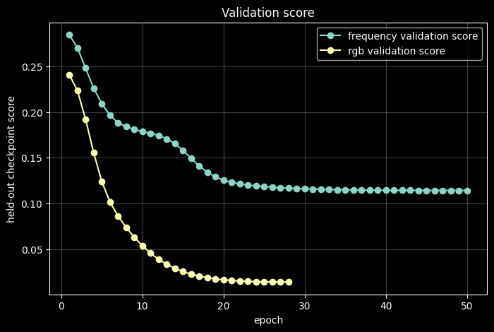
</p>
<p align="center"><em>Figure 2. Validation-score trajectories observed during training for the frequency-domain model and the RGB baseline.</em></p>

---

# 12. DDIM Sampling

A standard DDPM with 1000 reverse diffusion steps is computationally expensive.

The project therefore evaluates **DDIM sampling** as an inference-time acceleration technique.

The default final frequency-model evaluation uses:

```text
DDIM steps = 200
```

---

# 13. Evaluation Protocol

Evaluation is intentionally divided into two different groups.

## Visual / perceptual evaluation

These metrics measure the quality of the reconstructed RGB images:

- Face Detection Rate
- Fréchet Inception Distance (**FID**)
- Kernel Inception Distance (**KID**)
- Inception Score (**IS**)

## Frequency / forensic evaluation

These metrics evaluate whether the generated images reproduce real spectral statistics:

- mean-spectrum L1 distance;
- radial-profile L1 distance;
- high-frequency energy;
- radial-band energy distribution;
- spectral slope;
- localized spectral peak score;
- broad-band sliced Wasserstein distance;
- frequency-based real/fake classification;
- residual-FFT real/fake classification;
- JPEG + resizing robustness;
- period-4 grid score.

This separation is important because a model may produce visually plausible images while still containing abnormal spectral fingerprints.

Conversely, matching average spectral statistics does not guarantee a coherent image.

---

# 14. Grouped Forensic Evaluation

A simple classifier can sometimes exploit correlations between frames from the same video rather than actual generator fingerprints.

To reduce this problem, the forensic classifiers use **grouped evaluation at the video level**.

Frames originating from the same real video are kept within the same group during evaluation.

The main probes are based on logistic regression over frequency-derived descriptors.

For forensic AUC:

```text
AUC = 0.5
```

corresponds to chance-level separation.

Therefore, when comparing generated images against real images:

> **A lower AUC, approaching 0.5, indicates that generated images are harder to distinguish from real ones.**

---

# 15. Main Results

The completed experiment used 1,000 generated samples for the main metric comparison.

| Metric | Frequency DDPM | RGB DDPM |
|---|---:|---:|
| Face detection rate | 0.9961 | **1.0000** |
| FID ↓ | 162.15 | **116.31** |
| KID ↓ | 0.12943 | **0.07612** |
| Inception Score ↑ | 1.93 ± 0.16 | **2.13 ± 0.16** |
| Mean-spectrum L1 ↓ | **0.01764** | 0.01976 |
| Radial-profile L1 ↓ | **0.02616** | 0.02820 |
| High-frequency energy / real | **0.513** | 0.456 |
| Band SWD ↓ | **0.524** | 0.736 |
| Grouped DCT AUC ↓ | **0.740** | 0.969 |
| Residual-FFT grouped AUC ↓ | **0.675** | 0.957 |
| JPEG+resize DCT AUC ↓ | **0.681** | 0.769 |
| JPEG+resize residual-FFT AUC ↓ | **0.716** | 0.773 |
| Localized peak score ↓ | **0.0867** | 0.1029 |
| Period-4 grid score | 1.0134 | 1.0123 |


### Generated samples

<p align="center">
  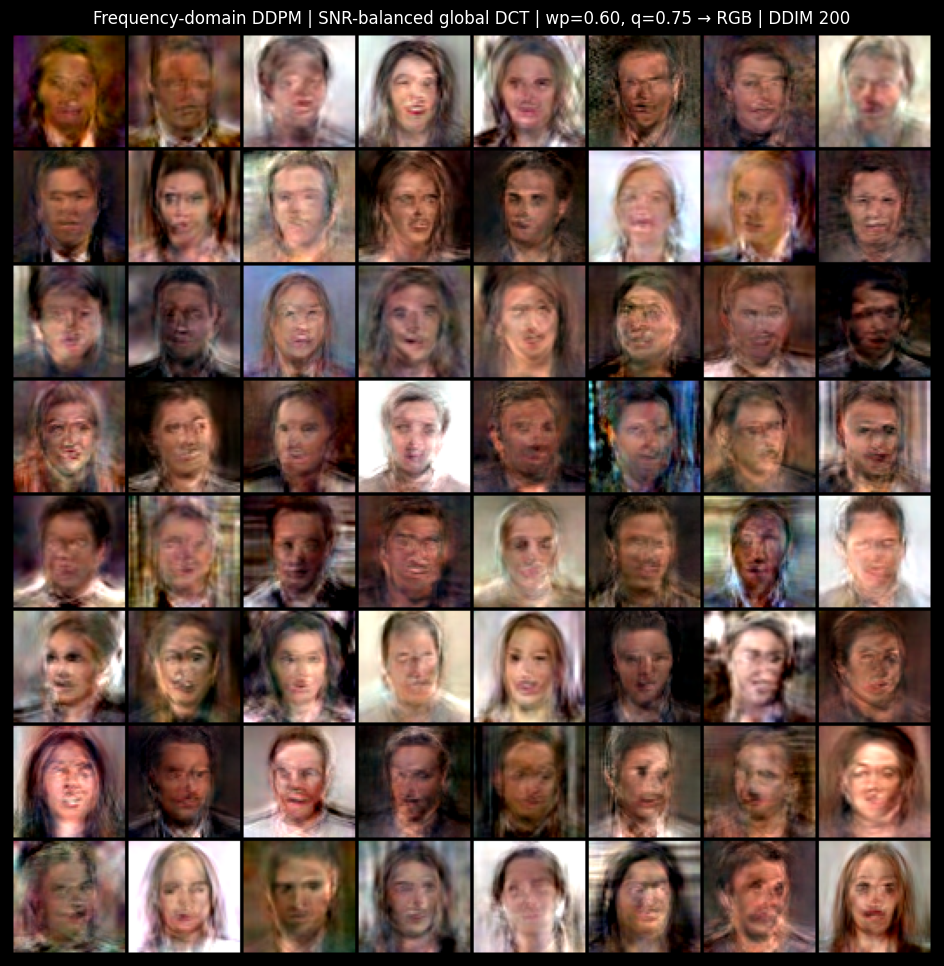
  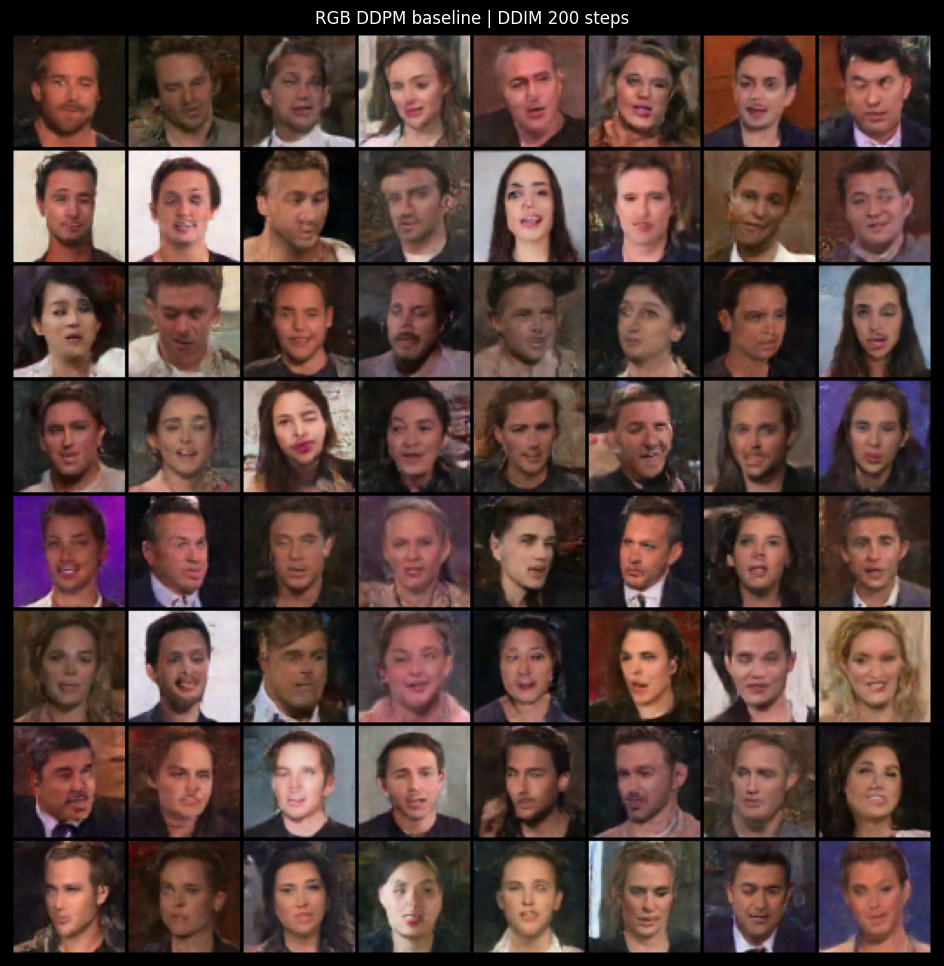
</p>
<p align="center"><em>Figure 3. Generated faces from the frequency-domain DDPM (left) and RGB DDPM baseline (right). The RGB baseline is visually sharper and more coherent, while the frequency-domain model is evaluated primarily for its spectral behavior.</em></p>

---

# 16. Interpretation of the Results

The results show a clear trade-off.

## Visual quality

The RGB model performs substantially better according to conventional perceptual generation metrics.

For example:

```text
FID
RGB:        116.31
Frequency:  162.15
```

and:

```text
KID
RGB:        0.0761
Frequency:  0.1294
```

The conventional spatial representation therefore remains easier for the compact U-Net to model.

---

## Spectral fidelity

The result changes when the generated images are evaluated in the frequency domain.

The frequency-domain DDPM obtains lower errors for:

- mean spectral distribution;
- radial spectral distribution;
- broad-band spectral statistics;
- localized spectral peaks.

For example:

```text
Band SWD
Frequency: 0.524
RGB:       0.736
```

This suggests that directly modeling DCT coefficients improves the reproduction of the spectral statistics of real data.


<p align="center">
  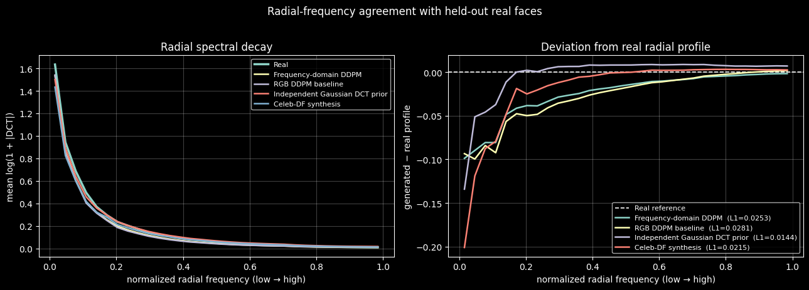
</p>
<p align="center"><em>Figure 4. Radial-frequency agreement with held-out real faces. The frequency-domain DDPM achieves a lower radial-profile deviation from real data than the RGB DDPM baseline, indicating improved agreement with the real spectral decay.</em></p>

<p align="center">
  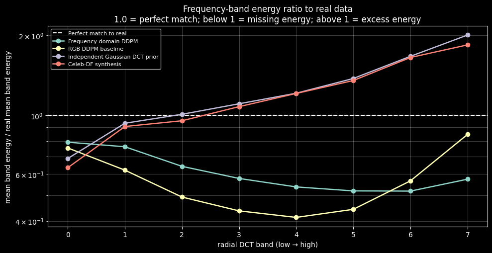
</p>
<p align="center"><em>Figure 5. Frequency-band energy ratio relative to real images. A ratio of 1 indicates perfect agreement, values below 1 indicate missing spectral energy, and values above 1 indicate excess energy. The frequency-domain DDPM shows reduced spectral imbalance compared with the RGB baseline across several frequency bands.</em></p>

<p align="center">
  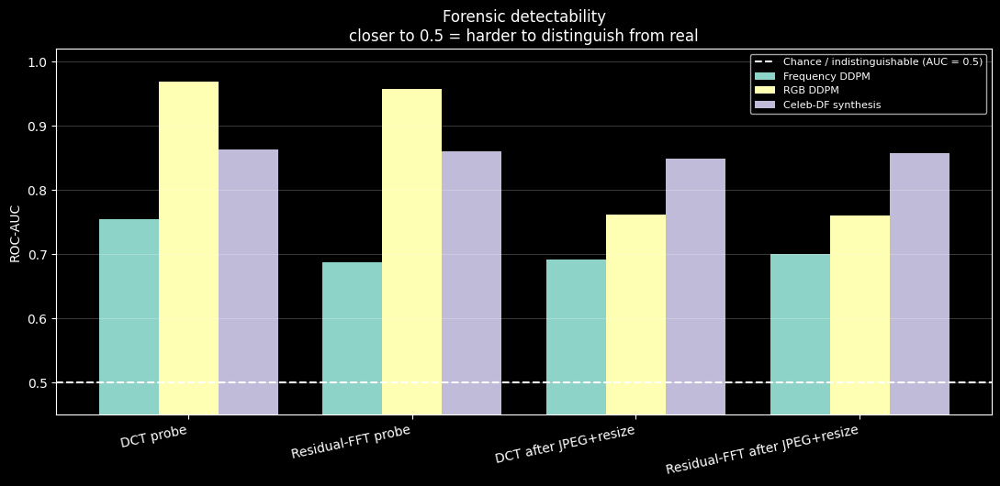
</p>
<p align="center"><em>Figure 6. Forensic detectability of generated images using DCT- and residual-FFT-based probes. ROC-AUC values closer to 0.5 indicate greater similarity to real images. The frequency-domain DDPM is consistently harder to distinguish from real data than the RGB DDPM baseline, both before and after JPEG compression and resizing.</em></p>

---

# 17. Forensic Detectability

One of the strongest results is obtained from the grouped forensic classifiers.

### DCT-based detector

```text
Frequency DDPM: AUC = 0.740
RGB DDPM:       AUC = 0.969
```

### Residual-FFT detector

```text
Frequency DDPM: AUC = 0.675
RGB DDPM:       AUC = 0.957
```

Since an AUC of 0.5 corresponds to chance-level discrimination, the generated images from the frequency-domain model are substantially harder to distinguish from real images using these spectral forensic features.

This supports the main hypothesis of the project:

> **Training diffusion directly in frequency space can reduce the spectral fingerprint left by the generative process.**

However, the AUC remains above 0.5.

The fingerprint is therefore **mitigated, not eliminated**.

---

# 18. Robustness to JPEG Compression and Resizing

Forensic artifacts can be modified by common image-processing operations such as:

- JPEG compression;
- resizing;
- social-media processing.

The experiment therefore repeats the forensic tests after JPEG compression and resizing.

Results:

| Probe | Frequency DDPM | RGB DDPM |
|---|---:|---:|
| JPEG+resize DCT AUC ↓ | **0.681** | 0.769 |
| JPEG+resize residual-FFT AUC ↓ | **0.716** | 0.773 |

The frequency-domain model remains less separable from real images after this post-processing.

This suggests that the observed improvement is not limited only to pristine generated images.

---

# 19. Grid-Artifact Analysis

A period-4 grid diagnostic was also included.

Results:

```text
Frequency DDPM: 1.0134
RGB DDPM:       1.0123
```

No meaningful advantage is visible for the frequency model under this specific measure.

This result is important for interpreting the experiment correctly.

The project does **not** demonstrate that every possible frequency artifact disappears.

Instead, the evidence supports a more limited conclusion:

> The frequency-domain model reduces the **overall spectral mismatch and forensic detectability**, but does not uniformly remove all individual artifact types.

---

# 20. Gaussian-DCT Control Experiment

An additional sanity experiment generates DCT coefficients independently from Gaussian distributions fitted to the real coefficient statistics.

This control obtains a surprisingly good mean-spectrum match but extremely poor image quality:

```text
FID ≈ 467.7
Face detection rate ≈ 3.9%
```

This experiment demonstrates an important point:

> **Matching marginal or average frequency statistics is not sufficient to generate coherent images.**

A generative model must learn the dependencies between frequency coefficients.

The improved spectral performance of the frequency DDPM therefore cannot be explained only by independently reproducing the variance of individual DCT frequencies.


<p align="center">
  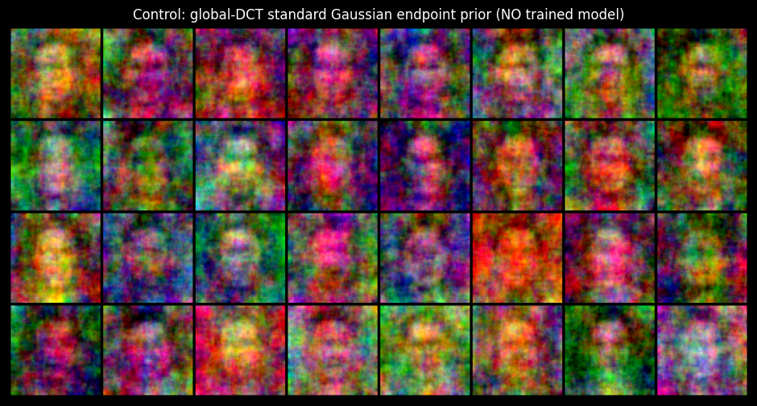
</p>
<p align="center"><em>Figure 7. Samples from the independent Gaussian-DCT control. Although marginal spectral statistics can be matched, the reconstructed images are not semantically coherent.</em></p>

---

# 21. DDIM Sampling Ablation

The project evaluates the trade-off between sampling speed and spectral fidelity.

| Sampler | Steps | Images/s | Mean-spectrum L1 ↓ | Radial-profile L1 ↓ |
|---|---:|---:|---:|---:|
| DDIM | 25 | ~6.2 | 0.0291 | 0.0462 |
| DDIM | 50 | ~5.9 | 0.0227 | 0.0362 |
| DDIM | 100 | ~3.1 | 0.0227 | 0.0352 |
| DDIM | 200 | ~1.6 | **0.0171** | **0.0271** |
| DDPM | 1000 | ~0.29 | 0.0275 | 0.0383 |

On the hardware used for this experiment, DDIM-200 achieved approximately a **5.5× throughput increase** compared with full 1000-step DDPM sampling.


### Qualitative sampler comparison

<p align="center">
  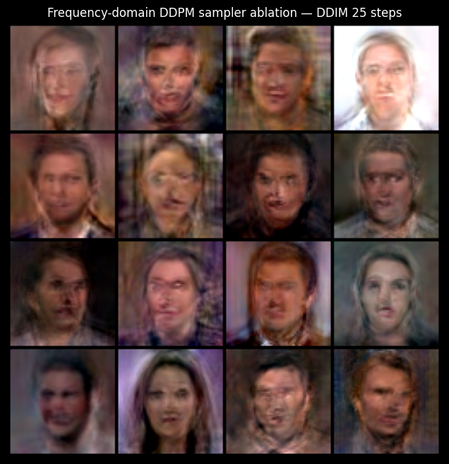
  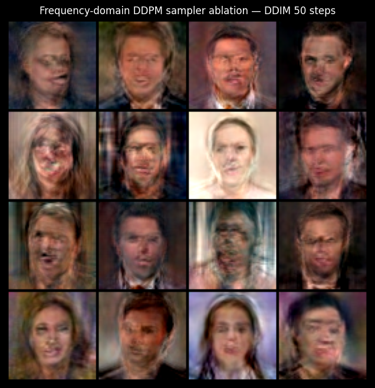
</p>
<p align="center"><em>DDIM with 25 steps (left) and 50 steps (right).</em></p>

<p align="center">
  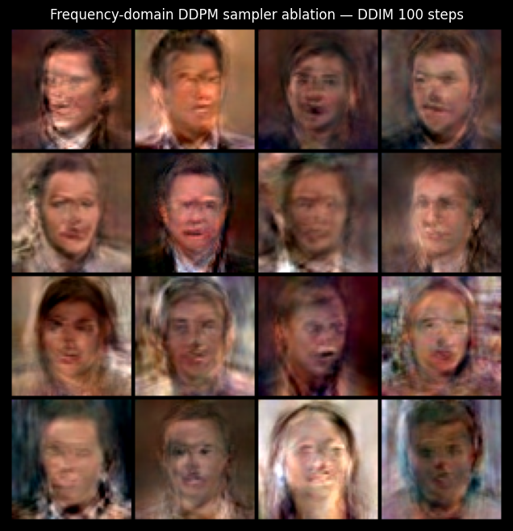
  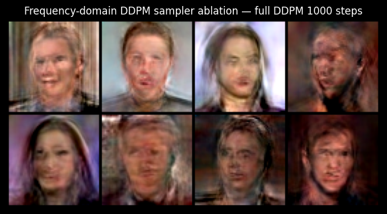
</p>
<p align="center"><em>Figure 8. DDIM with 100 steps (left) compared with full 1000-step DDPM sampling (right). Together with the quantitative table above, these examples illustrate the speed-quality trade-off.</em></p>

---

# 22. Final Conclusion

The experiments partially support the original hypothesis.

The frequency-domain DDPM does **not** outperform the RGB baseline in conventional image-quality metrics.

The RGB model achieves:

- lower FID;
- lower KID;
- higher Inception Score.

However, the frequency-domain DDPM consistently performs better on several spectral and forensic measurements.

Most importantly, frequency-domain generated images are substantially more difficult to distinguish from real images using both DCT-based and residual-FFT forensic classifiers.

The project therefore demonstrates that: **perceptual realism and spectral realism are related but distinct objectives.**

Improving the generated frequency distribution does not automatically produce better FID.

At the same time, a model with worse conventional visual metrics can produce spectra that are significantly closer to the statistics of real images.

---

# 23. Limitations

The most important limitations are:

- images are generated only at **64 × 64** resolution;
- the experiments use a single face dataset;
- the frequency model uses a global DCT representation;
- the U-Net remains primarily convolutional despite operating on frequency coefficients;
- the models are intentionally compact because of limited GPU memory;
- only a limited number of hyperparameter configurations could be evaluated;
- the frequency model does not match the RGB baseline on FID or KID;
- spectral forensic AUC remains above chance;
- the period-4 grid metric does not improve significantly.

The results therefore provide experimental evidence that the choice of generative representation strongly influences the spectral fingerprint of generated images.

---

# 24. Hardware

The completed experiment was run on:

```text
GPU: NVIDIA GeForce RTX 3050 Ti Laptop GPU
VRAM: 4 GB
CUDA: 12.6
PyTorch: 2.12.0+cu126
```

The limited GPU memory strongly influenced the choice of:

- 64 × 64 resolution;
- compact U-Net architecture;
- mixed-precision training;
- cached preprocessing;
- cached generated samples;
- DDIM sampling.


---

# 25. Requirements

The project is implemented in Python using PyTorch.

Main dependencies include:

```text
numpy
pandas
matplotlib
Pillow
torch
torchvision
opencv-python
scikit-learn
torchmetrics
facenet-pytorch
```

---

# 26. Configurations

Training and sampling diffusion models can be expensive.

The notebook therefore supports reuse of:

- dataset caches;
- model checkpoints;
- generated samples;
- evaluation artifacts.

Also a lightweight debugging configuration is available through:

```python
CFG.debug = True
```

This mode is intended for checking that the complete pipeline executes correctly before starting full training.

---


# 27. References

1. **Frank, J., Eisenhofer, T., Schönherr, L., Fischer, A., Kolossa, D., & Holz, T.**  
   *Leveraging Frequency Analysis for Deep Fake Image Recognition.*  
   International Conference on Machine Learning (ICML), 2020.

2. **Corvi, R., Cozzolino, D., Zingarini, G., Poggi, G., Nagano, K., & Verdoliva, L.**  
   *On the Detection of Synthetic Images Generated by Diffusion Models.*  
   IEEE International Conference on Acoustics, Speech and Signal Processing (ICASSP), 2023.

3. **Xu, L. et al.**  
   *Text-to-image with Frequency Domain Diffusion Models.*  
   SPIE, 2025.

4. **Song, T. et al.**  
   *FilterDiff: Noise-free Frequency-domain Diffusion Models for Accelerated MRI Reconstruction.*  
   MICCAI, 2025.

---

# 28. Author

**Student:** Spina Marco  
**Course:** Computer Vision  
**Academic Year:** 2025–2026  
**Project:** Project 6 — Frequency-Domain Diffusion Models  
**Institution:** Sapienza University of Rome

---


